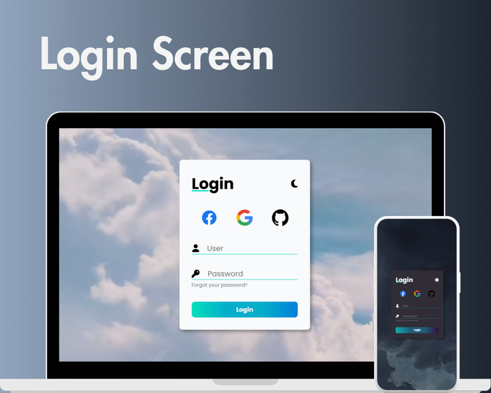

<h1 align="center"> Login Screen </h1>

  <a href="#-tecnologias">Tecnologias</a>&nbsp;&nbsp;&nbsp;|&nbsp;&nbsp;&nbsp;
  <a href="#-projeto">Projeto</a>&nbsp;&nbsp;&nbsp;|&nbsp;&nbsp;&nbsp;
  <a href="#-licença">Licença</a>

  

 

  

## 🚀 Tecnologias

Esse projeto foi desenvolvido com as seguintes tecnologias:

- HTML e CSS
- JavaScript
- Git e Github

## 💻 Projeto

Tela de login responsiva com light/dark mode.
Para verificar a validação do formulário digite "admin" na campo de usuário e "adminpass" no campo de senha.
A mensagem "Success!" indica que o usuário e senha estão corretos e a mensagem "Invalid Credentials!" indica usuário ou
senha incorretos.

## 📝 Licença

Esse projeto está sob a licença MIT.

---

Feito por Sullara Tavares
